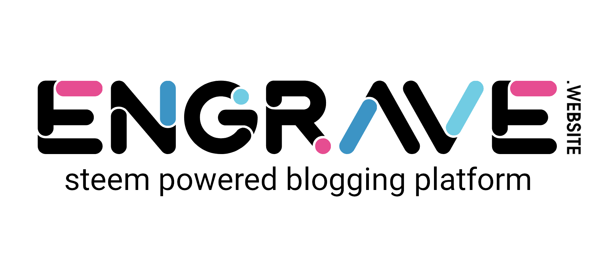

# Engrave Media Kit

## Engrave colors

### #007eb7

With 79.6% opacity, rgba(0,126,183,203)
.png)

### #e31979

With 79.6% opacity, rgba(0,126,183,203)
.png)

### #4dc1de

With 79.6% opacity, rgba(77,193,222,203)
.png)

### #000000

## Engrave logo

### SVG

### PNG (2048px width))

### PNG (1024px width))

### PNG (512px width))

### PNG (256px width))

### PNG (128px width))

## Square

## Engrave Sticker:

